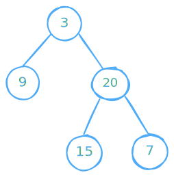

import { Callout, Steps, FileTree, Tabs } from "nextra/components";
import { CodeBlock } from "nextra/components";

# 404. Sum of Left Leaves

Given the `root` of a binary tree, return the sum of all left leaves.

A leaf is a node with no children. A left leaf is a leaf that is the left child of another node.

**Example 1:**



```bash
Input: root = [3,9,20,null,null,15,7]
Output: 24
Explanation: There are two left leaves in the binary tree, with values 9 and 15 respectively.
```

**Example 2:**

```bash
Input: root = [1]
Output: 0
```

## Approach

<Steps>

### Base Case

If `root` is `NULL`, return immediately.

### Processing Left Leaf Nodes

- Check if `root` has a `left child` `(root->left != NULL)`.

  - **If the left child is a leaf** (both left and right are NULL), add its value to sum.

- Recursively call `sumOfLeftLeaves(root->left)` to process the left subtree.
- Recursively call `sumOfLeftLeaves(root->right)` to process the right subtree.

</Steps>

## Code

<details>
<summary>Click to open</summary>

<br />

```cpp copy showLineNumbers {6,7,8,9}
class Solution {
public:
    int sum;
    int sumOfLeftLeaves(TreeNode* root) {
        if (root != NULL) {
            if (root->left != NULL) {
                if (root->left->left == NULL && root->left->right == NULL)
                    sum += root->left->val;
            }
            sumOfLeftLeaves(root->left);
            sumOfLeftLeaves(root->right);
        }
        return sum;
    }
};
```

<Callout>Time Complexity: O(N) | Space Complexity: O(N)</Callout>

</details>
